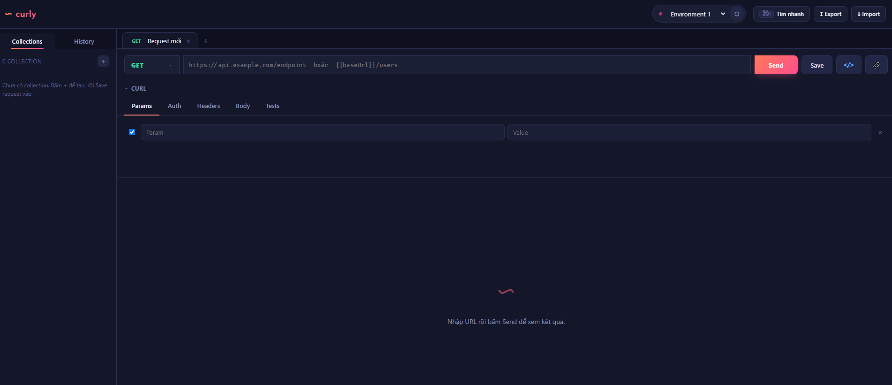

<div align="center">

# curly

**Công cụ kiểm thử REST API chạy trực tiếp trên trình duyệt** — nhẹ, nhanh, không cần cài đặt hay tài khoản.

[](https://github.com/hanhlt107/curly/actions/workflows/ci.yml)
[](https://github.com/hanhlt107/curly/actions/workflows/deploy.yml)
[](LICENSE)

[**Dùng thử ngay →**](https://hanhlt107.github.io/curly/)



</div>

## Mục lục

- [Vì sao chọn curly](#vì-sao-chọn-curly)
- [Tính năng](#tính-năng)
- [Kiểm thử tự động](#kiểm-thử-tự-động)
- [Công nghệ](#công-nghệ)
- [Bắt đầu nhanh](#bắt-đầu-nhanh)
- [Đồng bộ cloud (tùy chọn)](#đồng-bộ-cloud-tùy-chọn)
- [Triển khai](#triển-khai)
- [Lưu ý về CORS](#lưu-ý-về-cors)
- [License](#license)

## Vì sao chọn curly

- **Không cài đặt, không tài khoản** — mở link là dùng được ngay trên trình duyệt.
- **Riêng tư** — toàn bộ dữ liệu (request, collection, biến môi trường, lịch sử) lưu cục bộ trong trình duyệt, không gửi lên bất kỳ máy chủ nào.
- **Nhẹ và nhanh** — gói build chỉ vài trăm KB, khởi động tức thì.

## Tính năng

- Hỗ trợ đầy đủ HTTP method: `GET`, `POST`, `PUT`, `PATCH`, `DELETE`, `HEAD`, `OPTIONS`
- Cấu hình Query Params, Headers và Authorization (Bearer, Basic, API key)
- Nhiều định dạng body: JSON, Raw, GraphQL, Form-data, URL-encoded
- Response chi tiết: status, thời gian phản hồi, dung lượng, headers, body được format
- So sánh (diff) response giữa các lần gọi
- Quản lý request theo Collection và chạy toàn bộ collection
- Biến môi trường với cú pháp `{{variable}}` dùng trong URL, header và body
- **Extract biến từ response** — tự lấy giá trị theo JSON path (`data.access_token`, `items.0.id`), header hoặc status vào biến môi trường, không cần viết code
- Pre-request / post-response script để lấy token động, truyền biến giữa các request
- Command palette tìm kiếm nhanh (`Ctrl / ⌘ + K`), giao diện sáng/tối
- Import từ Postman và cURL, export workspace, chia sẻ request qua link

## Kiểm thử tự động

- Viết assertion cho response: `status === 200`, `time < 2000`, `body contains "..."`, `body matches /regex/`, `header content-type contains json`, `json data.id === 1`, `json data.count > 0`
- **Collection Runner**: chạy toàn bộ collection, tự truyền biến giữa các request
- Chạy lặp nhiều vòng, đặt delay, hoặc data-driven theo file CSV/JSON
- Tùy chọn dừng khi gặp lỗi, xuất báo cáo kết quả ra JSON

## Công nghệ

React · Vite · TypeScript · axios

## Bắt đầu nhanh

Yêu cầu Node.js 18 trở lên.

```bash
npm install
npm run dev
```

Ứng dụng chạy tại http://localhost:5200.

| Lệnh                | Mô tả                                  |
| ------------------- | -------------------------------------- |
| `npm run dev`       | Chạy môi trường phát triển             |
| `npm run build`     | Build bản production vào `dist/`       |
| `npm run preview`   | Xem thử bản build                      |
| `npm run typecheck` | Kiểm tra kiểu dữ liệu                  |
| `npm run lint`      | Kiểm tra lint (ESLint)                 |
| `npm run format`    | Định dạng code (Prettier)              |
| `npm run check`     | Chạy toàn bộ typecheck + lint + format |

## Đồng bộ cloud (tùy chọn)

curly hoạt động hoàn toàn offline theo mặc định. Nếu muốn đăng nhập và đồng bộ collection, biến môi trường lên cloud, hãy cấu hình [Supabase](https://supabase.com):

1. Tạo project miễn phí trên Supabase.
2. Vào **SQL Editor**, chạy nội dung file [`supabase/schema.sql`](supabase/schema.sql) để tạo bảng `workspaces` và Row Level Security.
3. (Tùy chọn) Bật đăng nhập Google trong **Authentication → Providers → Google**.
4. Copy `.env.example` thành `.env` và điền:

   ```bash
   VITE_SUPABASE_URL=https://your-project-ref.supabase.co
   VITE_SUPABASE_ANON_KEY=your-anon-public-key
   ```

Lấy hai giá trị này trong **Project Settings → API**. Nếu không cấu hình `.env`, nút đăng nhập sẽ ẩn và ứng dụng chạy offline như bình thường.

Khi đăng nhập, dữ liệu được merge với bản cục bộ rồi tự lưu lên cloud sau mỗi thay đổi. Mỗi người dùng chỉ đọc/ghi được workspace của chính mình nhờ Row Level Security.

## Triển khai

Dự án được cấu hình sẵn để triển khai lên GitHub Pages qua GitHub Actions. Sau khi fork, vào **Settings → Pages** và chọn **Source: GitHub Actions**. Mỗi lần push lên nhánh `main`, ứng dụng sẽ được build và cập nhật tự động.

Khi triển khai lên gốc domain (Vercel, Netlify, v.v.), hãy xóa dòng `base: '/curly/'` trong `vite.config.ts`.

## Lưu ý về CORS

curly chạy trong trình duyệt nên tuân theo chính sách CORS. Nếu API đích không trả về header `Access-Control-Allow-Origin` phù hợp, request sẽ bị trình duyệt chặn. Trong trường hợp này, cấu hình proxy trong `vite.config.ts`:

```ts
server: {
  proxy: {
    '/api': { target: 'https://api.example.com', changeOrigin: true },
  },
}
```

sau đó gọi qua đường dẫn `/api/...`.

## License

[MIT](LICENSE)
